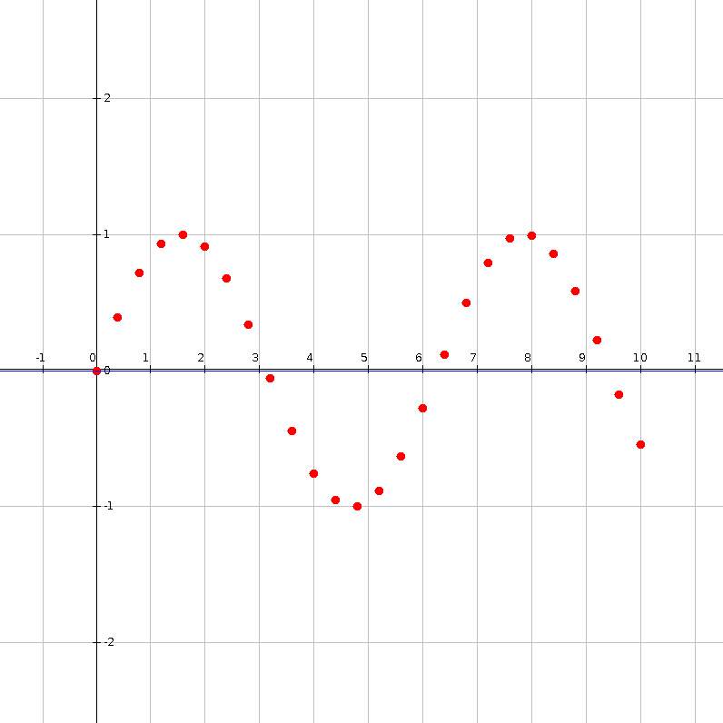
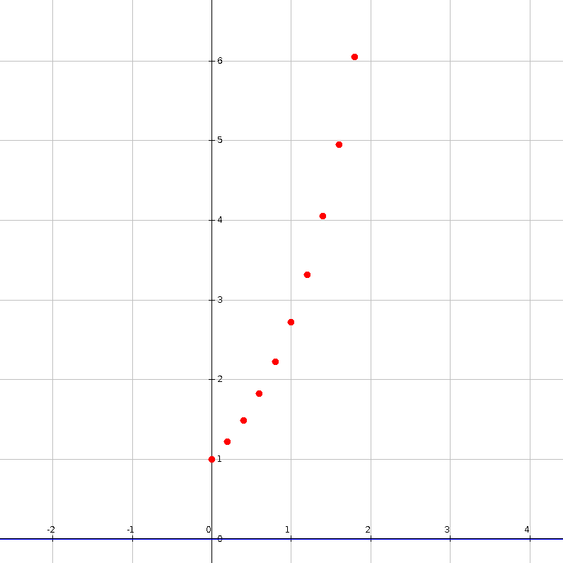

# Gradient-based-optimization
Gradient descent based methods

This project offers implementations of gradient based optimization.
A basic example of such optimization is gradient descent. 

The following ways of updating the solution are offered: 
* basic update
* momentum update
* adam update

If minimizing a loss function of a system described with input output examples then the following strategies are supported: 
* batch (calculate gradient in each algorithm step based on all examples)
* mini-batch (calculate gradient in each algorithm step based on some examples)
* stohastic (calculate gradient in each algorithm step based on a single example)

## Use of the library
The use of this library is quite simple. 
Let's say you wish to fit a sin function through a set of data points and have decided to use the following parameters: 
* ALGORITHM TYPE: Batch gradient descent
* LEARNING RATE: 0.25
* SOLUTION QUALITY: one divided by function value
* SOLUTION UPDATER: Basic
* STOPPING CONDITIONS: Function value close to 0, Number of function evaluations

Then this is done in the following way: 

```Java
double acceptableErrorRate = 10e-8;
int maximumNumberOfGenerations = 1_000_000;
		
//Function to optimize
SinFunction sinFunction = new SinFunction();
double[][] systemMatrix = DataSetLoader.loadMatrix(new File(System.getProperty("user.dir"),"data/sin-data.txt"));
DerivativeFunctionCallCounterWrapper function =  new DerivativeFunctionCallCounterWrapper(
				new PrototypeBasedSystemLossFunction(systemMatrix,sinFunction,new SquareErrorFunction()));		

//Start solution
int variableNumber = sinFunction.getCoefficientCount();
IStartSolutionGenerator<DoubleArraySolution> startSolutionGenerator = 
				new RandomStartSolutionGenerator(variableNumber);
		
//Decoder
IDecoder<DoubleArraySolution,double[]> decoder = new PassThroughDoubleDecoder();

//Encoder
IEncoder<DoubleArraySolution> encoder = new PassThroughEncoder();

//Fitness evaluator
PerChromosomeObservableFitnessEvaluator<DoubleArraySolution> evaluator = 
        new ThroughOneFitnessEvaluator(new FunctionValueFitnessEvaluator());
								
//Updater
double learningRate = 0.25;
IGradientBasedUpdater updater = new SimpleGradientUpdater(learningRate,variableNumber);
		
//Optimization stopper
IOptimisationStopper<DoubleArraySolution> stopper = new CompositeOptimisationStopper<>(Arrays.asList(
			new FunctionValueStopper<>(acceptableErrorRate),
			new GenerationNumberEvolutionStopper<>(maximumNumberOfGenerations)
		));
		
//Optimization
IOptimizationAlgorithm<DoubleArraySolution> optimizationAlgorithm = 
				new GradientDescent<DoubleArraySolution>(decoder, encoder , evaluator, updater, stopper, function, startSolutionGenerator);				

DoubleArraySolution solution = optimizationAlgorithm.run();
```

## Examples
In the examples source folder you can find several usage examples. All examples are divided into two groups:
* optimum detection and
* curve fitting.




